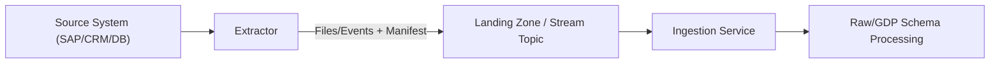

# Schema Registry — Extractor Schemas
> Applies to: Extractor Layer (shape & transport) • Owner: Platform Engineering • Last updated: 2025-10-07

## Objectives
Define the **shape and format of extraction outputs** produced by connectors/extractors — *not* the business payload schema.  
Extractor Schemas specify **transport envelope**, **file/stream layout**, **typing fidelity**, **batching/partitioning**, and **operational guarantees** so downstream ingestion is reliable and deterministic.

## Scope
Included:
- File/stream **envelope** (headers, manifests, checksums, metadata)
- **Record layout** constraints (column typing, encoding, null rules) without semantic normalization
- **Batching & partitioning** rules, CDC markers, watermarks, and ordering
- **Delivery & storage** conventions (naming, compression, encryption)
- **Error handling**, retries, and quarantine routing
- **SLA & observability** for extraction

Excluded:
- GDP/KPI field semantics, harmonization, or business keys (handled in Raw/GDP docs)
- Transformations beyond minimal extraction cleaning (e.g., trimming, simple casting)

---

## Core Responsibilities
- Provide a transport-accurate contract for **what an extractor emits**.
- Ensure stable **column typing** and **encoding** independent of source idiosyncrasies.
- Encode **change signals** (inserts/updates/deletes) in a consistent way.
- Guarantee reproducible **batching/partitioning** for scalable ingestion.
- Emit **manifests, checksums, and metrics** to verify completeness and integrity.

---

## Architecture Overview

- Extractor emits **transport-layer artifacts**; business semantics are deferred to Raw/GDP.
- Ingestion validates envelope & integrity before passing to normalization.

---

## Extraction Envelope (Transport Contract)
| Field              | Type    | Required | Description                                   |
|--------------------|---------|:--------:|-----------------------------------------------|
| `source_system`    | string  |    ✓     | System identifier (e.g., SAP, SFDC)           |
| `object`           | string  |    ✓     | Source object/table (e.g., BSEG, Opportunity) |
| `extract_window`   | object  |    ✓     | `{start_ts, end_ts}` ISO-8601                 |
| `batch_id`         | string  |    ✓     | Unique batch identifier (ULID/UUID)           |
| `sequence_no`      | integer |    ✓     | Ordering within batch for idempotent replay   |
| `watermark`        | string  |          | Source high-water mark (LWM/HWM key)          |
| `cdc_mode`         | enum    |    ✓     | `full`, `incremental`, or `change-log`        |
| `record_count`     | integer |    ✓     | Count of records in batch                     |
| `checksum`         | object  |    ✓     | Algorithm + value per file                    |
| `manifest_version` | string  |    ✓     | Version of envelope spec                      |

**Manifest Location**  
`s3://landing/<tenant>/<source>/<object>/dt=<YYYY-MM-DD>/batch=<batch_id>/manifest.json`

---

## Record Layout (Shape, Not Semantics)
- **File formats**: `PARQUET` (preferred), `JSONL` (fallback), `CSV` (legacy).  
- **Encoding**: UTF-8; newlines normalized to `\n`.  
- **Timestamps**: ISO-8601 with timezone (`Z` or explicit offset).  
- **Booleans**: `true/false` (JSONL) or logical type (Parquet).  
- **Numbers**: Fixed precision DECIMAL where applicable; avoid lossy floats.  
- **Nullability**: Explicit; `null` must be representable in JSONL and logical-null in Parquet.  
- **Field names**: `snake_case`. No spaces, no mixed case, no symbols beyond `_`.

**Minimal Casting Only**
- Perform safe, reversible casts (e.g., `CHAR→STRING`, `NUMBER→DECIMAL(p,s)` if precision known).  
- **Do not** rename business fields, collapse enums, or derive new columns at this stage.

---

## CDC & Ordering
| Attribute | Description |
|---|---|
| `cdc_mode` | `full`: snapshot; `incremental`: changed since watermark; `change-log`: source emits I/U/D ops |
| `op` | For change-log mode: `I` (insert), `U` (update), `D` (delete) |
| `op_ts` | Operation timestamp at source |
| `source_pk` | Source primary key (opaque at this stage) |
| `ordering_key` | Stable ordering column(s) for deterministic replay |

---

## Batching & Partitioning
- **Batch Size**: default target 128 MiB per file (Parquet), 100k records per JSONL file.  
- **Partitioning**: `dt=YYYY-MM-DD/part=<n>`; optional source-based partitions (e.g., company code).  
- **Idempotency**: batches re-writable to same path with identical `batch_id` and `sequence_no`.  
- **Late Data**: allowed up to 72h; late-arrivals appended with new `sequence_no`, annotated `is_late=true`.

**File Naming**
`{object}__dt={YYYY-MM-DD}__batch={batch_id}__seq={sequence_no}.{ext}.gz`

---

## Delivery, Compression, and Encryption
- **Compression**: GZIP for JSONL/CSV; Parquet with Snappy.  
- **Encryption**: SSE-KMS (required) with platform-managed keys.  
- **Transfer**: Multipart uploads; retries with exponential backoff.  
- **Checksums**: SHA-256 per file + manifest checksum roll-up.

---

## Error Handling & Quarantine
- On validation failure (bad checksum, schema mismatch, empty file), move payloads to:  
  `s3://landing-quarantine/<tenant>/<source>/<object>/<batch_id>/`  
- Write `error_report.json` with failure codes and first 100 offending rows (sample).  
- Emit `extractor.error` event to Observability with `batch_id`, `source`, `object`, and reason.

**Error Codes**
| Code | Meaning | Action |
|---|---|---|
| EX-1001 | Checksum mismatch | Re-upload batch |
| EX-1205 | Invalid envelope | Fix manifest fields |
| EX-1302 | Typing violation | Correct extractor mapping |
| EX-1404 | Empty or truncated file | Re-run extraction |

---

## Observability & SLAs
| Metric | Description | Unit | Target |
|---|---|---|---|
| `extractor.success_rate` | Successful batches / total | % | >99 |
| `extractor.latency_p95_ms` | Source→landing time | ms | <300000 |
| `extractor.bytes_emitted` | Total bytes written | bytes | trend |
| `extractor.late_arrival_ratio` | Late records over total | % | <2 |
| `extractor.quarantine_count` | Batches sent to quarantine | count/day | 0 |

**SLOs**
- Landing manifest availability ≤ 2 minutes after batch close (P95).  
- Catalog registration ≤ 5 minutes after manifest write.  

---

## Configuration
| Parameter | Description | Required | Default |
|---|---|:---:|---|
| `format` | `parquet` / `jsonl` / `csv` | ✓ | `parquet` |
| `compression` | `snappy` / `gzip` |  | `snappy` (parquet), `gzip` otherwise |
| `batch_target_bytes` | Target uncompressed batch size |  | 134217728 |
| `partitioning` | Partition strategy |  | `dt,part` |
| `cdc_mode` | Snapshot or change-log mode | ✓ | `incremental` |
| `watermark_key` | High-water mark field |  | `updated_at` |
| `timezone` | Timestamp zone handling |  | `UTC` |

---

## Example — SAP BSEG Extraction (JSONL)
**manifest.json**
```json
{
  "source_system": "SAP",
  "object": "BSEG",
  "extract_window": {"start_ts": "2025-10-06T00:00:00Z", "end_ts": "2025-10-07T00:00:00Z"},
  "batch_id": "01J9CZVQ8H5V6M3PN0Z8FY1A9E",
  "sequence_no": 1,
  "cdc_mode": "incremental",
  "record_count": 102345,
  "checksum": {"algo": "sha256", "value": "b9c6...a1"},
  "manifest_version": "v1.0"
}
```

**data.jsonl.gz** (first 2 records)
```json
{"op":"U","op_ts":"2025-10-06T12:03:11Z","source_pk":"10001234","bukrs":"1000","belnr":"1900001234","gjahr":"2025","wrbtr":"1299.50","waers":"INR","budat":"2025-10-06"}
```

---

## Governance Notes
- **Ownership & Scope:** Extractor Schemas are **global platform assets**. Tenants consume them during onboarding and **cannot publish or modify** them. Tenant-specific needs (e.g., Z/Y tables) are implemented as **platform-approved custom schemas** under tenant namespace and follow the same validation → governance → publish pipeline.
- Versioning follows **minor for additive typing clarifications**, **major for shape changes** that alter field presence or types.
- Tenant CRs for new columns or additional extraction objects must cite source evidence and provide sample records.

---

## Versioning & Change Management
- Any change to envelope or record layout increments **manifest_version**.
- Data file field changes use semantic versions: `v<major>.<minor>[.<patch>]` aligned to Extractor Schema index.
- Backward compatibility for JSONL requires **fields only added**; Parquet schema evolution supported when widening types.

---
