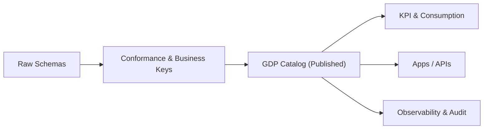

# Schema Registry — GDP Schemas
> Applies to: Golden Data Points (semantic layer) • Owner: Platform Engineering • Last updated: 2025-10-07

## Purpose
Define **Golden Data Point (GDP)** schemas — normalized, source‑agnostic business entities that power analytics, KPIs, and downstream applications.  
GDP schemas establish **stable business contracts** with clear keys, meanings, and compatibility guarantees across tenants.

> **Layering:** Extractor = transport contract → **Raw** = minimal normalization → **GDP** = semantic model.  
> GDP does **not** mirror source tables; it expresses business entities and relationships.

---

## Objectives
- Provide **source‑agnostic** entity contracts (Customer, Invoice, Payment, Product, etc.).  
- Enforce **business keys**, **type discipline**, and **semantics** (units, currencies, dimensions).  
- Preserve **lineage** from GDP back to Raw/Extractor for auditability.  
- Guarantee **compatibility and versioned evolution** (semver + policy).  
- Keep schemas **tenant‑portable** with global definitions and optional tenant extensions.

---

## Scope
Included:
- Entity definition, keys, relationships, conformance rules.  
- Standard dimensions (org, geography, product), units and currencies.  
- Slowly Changing Dimensions (SCD) handling guidance.  
- Data quality hooks (not runtime rules).

Excluded:
- KPI calculations and aggregates (see KPI Schemas).  
- Runtime transformation logic (defined in Pipelines).

---

## Architecture Overview

- **Conformance** resolves business keys, units, currencies, and reference maps.  
- **GDP Catalog** publishes immutable, versioned entity contracts.

---

## GDP Contract (Envelope Excerpt)
| Field | Type | Req | Description |
|---|---|:--:|---|
| `fqid` | string | ✓ | `<domain>.gdp.<subject>:vX.Y[.Z]` |
| `compatibility_policy` | enum | ✓ | `full | forward | none` (default: `full`) |
| `depends_on` | array<string> |  | Raw/GDP FQIDs used to derive this entity |
| `business_keys` | array<string> | ✓ | Natural keys (stable, not surrogate ids) |
| `dimensions` | array<string> |  | Organizational and analytical dims |
| `lineage` | object |  | Field‑level or table‑level mapping metadata |

> **Keying principle:** Prefer **business keys** (e.g., `invoice_id`, `customer_id`). Avoid exposing engine‑generated surrogate keys in the contract; those remain internal to pipelines.

---

## GDP Payload Descriptor (Fields)
| Field | Type | Req | Notes |
|---|---|:--:|---|
| `invoice_id` | STRING | ✓ | Business key (unique) |
| `customer_id` | STRING | ✓ | Ref: `finance.gdp.customer` |
| `invoice_date` | DATE | ✓ |  |
| `currency_code` | STRING | ✓ | ISO‑4217 |
| `amount_net` | DECIMAL(18,2) | ✓ | Currency amount |
| `amount_tax` | DECIMAL(18,2) |  |  |
| `due_date` | DATE |  |  |
| `payment_term_code` | STRING |  |  |
| `org_unit` | STRING | ✓ | Dimension (company / BU) |
| `country_code` | STRING |  | ISO‑3166‑1 alpha‑2 |
| `is_cancelled` | BOOLEAN |  |  |
| `source_refs` | JSON |  | Field‑level lineage annotations |

**Semantics block (per field, optional)**
```json
{
  "name": "amount_net",
  "type": "DECIMAL(18,2)",
  "nullable": false,
  "semantics": {"unit": "currency", "currency_code": "INR"}
}
```

---

## Conformance Rules
- **Type discipline:** prefer `DECIMAL` for currency; `DATE/TIMESTAMP` for temporal.  
- **Naming:** `snake_case` for all fields.  
- **Units & Currencies:** express explicitly via `semantics` (no inferred units).  
- **Dimensions:** model as **attributes** on GDP or separate normalized GDPs (e.g., `customer`, `org_unit`).  
- **References:** use FQIDs in `depends_on` and `semantics.reference` for cross‑entity links.

---

## SCD Guidance
GDP schemas are **logical contracts**; SCD is a **data handling policy** applied by pipelines. Use these patterns:

| Pattern | When to Use | Contract Impact |
|---|---|---|
| **SCD‑1** | Correct past values (overwrite on change) | No additional columns |
| **SCD‑2** | Track history (effective periods) | Add `valid_from`, `valid_to`, `is_current` |
| **SCD‑4 (snapshot)** | Periodic snapshots | Add snapshot date dimension |

> Choose one pattern **per entity** and document it in the GDP schema `description` and `tags`.

---

## Compatibility Policy (Normative)
| Change | full | forward | none |
|---|:--:|:--:|:--:|
| Add optional field | ✓ | ✓ | ✓ |
| Add required field | ✕ | ✕ | ✓ |
| Rename / remove field | ✕ | ✕ | ✓ |
| Type widen (INT→DECIMAL) | ✓ | ✓ | ✓ |
| Type narrow | ✕ | ✕ | ✓ |
| Constraint tighten | ✕ | ✕ | ✓ |
| Constraint loosen | ✓ | ✓ | ✓ |

**Versioning:**  
- Compatible → **minor** (`v1.1 → v1.2`).  
- Breaking → **major** (`v1.x → v2.0`).  
- Metadata‑only (description/tags) → **patch**.

---

## Observability
| Metric | Description | Unit | Target |
|---|---|---|---|
| `gdp.publish_success_rate` | Published GDP schemas / total attempts | % | >99 |
| `gdp.conformance_latency_ms` | Raw→GDP conformance time | ms | P95 ≤ 180000 |
| `gdp.lineage_coverage_pct` | Fields with lineage mapping | % | ≥95 |
| `gdp.breaking_change_rate` | Major versions / all changes | % | <10 |

**Events**  
`GDPConformed`, `GDPPublished`, `GDPDeprecated`, `GDPLineageDrift`

---

## Error Catalog
| Code | Condition | Operator Action |
|---|---|---|
| GDP-1001 | Missing/invalid business key | Fix mapping; enforce uniqueness |
| GDP-1102 | Currency/units missing on amounts | Add `semantics.currency_code` |
| GDP-1204 | Unresolved lineage dependency | Publish upstream Raw/GDP |
| GDP-1303 | Compatibility violation | Bump major or adjust change |
| GDP-1401 | Dimension cardinality explosion | Normalize dimension or cap |

---

## Governance Notes
- **Ownership & Scope:** GDP Schemas are **global platform assets**. Tenants consume them; **modifications require Platform CRs**. Tenant‑specific additions are implemented as **tenant‑scoped GDP schemas** in `tenant.<code>` namespace, following the same validation → governance → publishing pipeline.  
- **Promotion:** Common tenant fields that prove generic may be proposed for promotion into global GDP via governance RFC.

---

## Examples

### Example A — GDP Invoice (v1.1)
```json
{
  "fqid": "finance.gdp.invoice:v1.1",
  "compatibility_policy": "full",
  "business_keys": ["invoice_id"],
  "dimensions": ["org_unit","country_code"],
  "depends_on": ["finance.raw.invoice_header:v1.0","finance.raw.invoice_item:v1.0"],
  "payload": [
    {"name":"invoice_id","type":"STRING","nullable":false,"constraints":{"unique":true}},
    {"name":"customer_id","type":"STRING","nullable":false,"semantics":{"reference":"finance.gdp.customer"}},
    {"name":"invoice_date","type":"DATE","nullable":false},
    {"name":"currency_code","type":"STRING","nullable":false},
    {"name":"amount_net","type":"DECIMAL(18,2)","nullable":false,"semantics":{"unit":"currency","currency_code":"INR"}},
    {"name":"amount_tax","type":"DECIMAL(18,2)","nullable":true}
  ]
}
```

### Example B — GDP Customer with SCD‑2
```json
{
  "fqid": "finance.gdp.customer:v2.0",
  "compatibility_policy": "full",
  "business_keys": ["customer_id"],
  "payload": [
    {"name":"customer_id","type":"STRING","nullable":false,"constraints":{"unique":true}},
    {"name":"customer_name","type":"STRING","nullable":false},
    {"name":"valid_from","type":"TIMESTAMP","nullable":false},
    {"name":"valid_to","type":"TIMESTAMP","nullable":true},
    {"name":"is_current","type":"BOOLEAN","nullable":false}
  ],
  "tags": ["scd2"]
}
```

---

## Versioning & Change Management
- All GDP schema changes are tracked with diff classification and audit events.  
- **Deprecated versions** remain queryable for ≥90 days.  
- Release notes include compatibility impact and migration advice.

---
