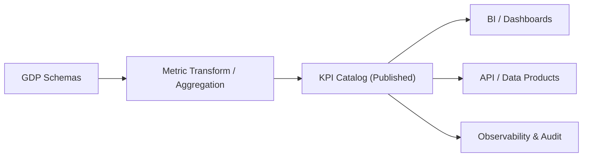

# Schema Registry — KPI / Consumption Schemas
> Applies to: Analytical & Consumption Layer • Owner: Platform Engineering • Last updated: 2025-10-07

## Purpose
Define **KPI / Consumption** schemas as stable, query-ready contracts for metrics, aggregates, and presentation datasets.  
These schemas translate GDP entities into **business outcomes** with explicit definitions, grain, filters, and dimensionality — consumable by BI tools, APIs, and data products.

> **Layering:** Extractor (transport) → Raw (minimal normalization) → GDP (semantic entities) → **KPI/Consumption (metrics & aggregates)**.

---

## Objectives
- Provide **unambiguous metric definitions** (formula, grain, filters, dimensionality).  
- Ensure **reproducibility** via versioned definitions and lineage to GDP inputs.  
- Support **consistency** across tenants by enforcing a global KPI catalog.  
- Maintain **SLAs** on freshness and completeness for consumption endpoints.

---

## Scope
Included:
- Metric contracts, time grain, dimensions, filters, SLO targets.  
- Aggregated fact tables and pre-computed views for BI/ML serving.  
- Lineage to GDP datasets and dimension conformance.  
- Compatibility/versioning policy for metric changes.

Excluded:
- Runtime dashboard configuration, visualization settings.  
- Ad-hoc query semantics not captured as reusable contracts.

---

## Architecture Overview

- **Metric Transform** resolves formulas, filters, and time grain to produce materialized or virtual datasets.  
- **KPI Catalog** publishes versioned, immutable metric contracts.

---

## KPI Contract (Envelope Excerpt)
| Field | Type | Req | Description |
|---|---|:--:|---|
| `fqid` | string | ✓ | `<domain>.kpi.<subject>:vX.Y[.Z]` (e.g., `finance.kpi.dso:v1.0`) |
| `compatibility_policy` | enum | ✓ | `full | forward | none` (default: `forward`) |
| `depends_on` | array<string> | ✓ | Input GDP FQIDs |
| `grain` | enum | ✓ | `daily | weekly | monthly | snapshot | as_of` |
| `dimensions` | array<string> | ✓ | Groupable attributes (e.g., `org_unit`, `country`) |
| `freshness_sla_minutes` | integer |  | Target freshness for materializations |
| `lineage` | object |  | Mapping of fields to GDP sources |

---

## KPI Payload Descriptor
Two descriptor types are permitted: **metrics** and **attributes (dimensions)**.

### Metrics
| Field | Type | Req | Notes |
|---|---|:--:|---|
| `name` | string | ✓ | `snake_case` metric id |
| `type` | enum | ✓ | `COUNT | SUM | AVG | RATIO | PERCENTILE` |
| `expression` | string | ✓ | DSL or SQL expression referencing GDP fields |
| `unit` | string |  | e.g., `currency`, `days`, `count` |
| `filters` | array<object> |  | Static filter predicates |
| `nullable` | boolean |  | Default `false` |
| `description` | string |  | Human definition |

### Dimensions (Attributes)
| Field | Type | Req | Notes |
|---|---|:--:|---|
| `name` | string | ✓ | `snake_case` |
| `type` | enum | ✓ | `STRING | DATE | TIMESTAMP | INTEGER` |
| `reference` | string |  | Optional GDP reference (for conformed dims) |

**Example Metric Definition**
```json
{
  "name": "dso_days",
  "type": "RATIO",
  "expression": "(sum(accounts_receivable) / sum(revenue)) * 30",
  "unit": "days",
  "description": "Days Sales Outstanding (approximation)"
}
```

---

## Compatibility Policy (Normative)
| Change | full | forward | none |
|---|:--:|:--:|:--:|
| Add non-breaking metric | ✓ | ✓ | ✓ |
| Add dimension | ✓ | ✓ | ✓ |
| Change formula semantics | ✕ | ✕ | ✓ |
| Rename/remove metric | ✕ | ✕ | ✓ |
| Tighten filters/defaults | ✕ | ✕ | ✓ |
| Relax filters/defaults | ✓ | ✓ | ✓ |

- Use **minor** for additive changes (new metric/dimension).  
- Use **major** for formula changes or metric/dimension removal.  
- Use **patch** for documentation-only or tag updates.

---

## Freshness & Materialization
- KPI schemas MAY specify `freshness_sla_minutes`.  
- Materialization strategies: `view`, `incremental`, or `full_refresh`.  
- Late GDP updates propagate to KPI materializations through orchestration events.

**Materialization Config (optional)**
```json
{
  "strategy": "incremental",
  "unique_key": ["org_unit","as_of_date"],
  "schedule": "hourly",
  "watermark": "updated_at"
}
```

---

## Observability
| Metric | Description | Unit | Target |
|---|---|---|---|
| `kpi.publish_success_rate` | Published KPI schemas / attempts | % | >99 |
| `kpi.materialize_latency_ms` | Build time per materialization | ms | P95 ≤ 300000 |
| `kpi.freshness_sla_breaches` | Breaches per day | count | 0 |
| `kpi.breaking_change_rate` | Major changes / all changes | % | <10 |

**Events**  
`KPIPublished`, `KPIMaterialized`, `KPIFreshnessBreached`

---

## Error Catalog
| Code | Condition | Operator Action |
|---|---|---|
| KPI-1001 | GDP dependency unresolved | Publish GDP first |
| KPI-1102 | Invalid formula/expression | Fix DSL/SQL |
| KPI-1204 | Dim not conformed | Map to GDP reference or whitelist |
| KPI-1303 | Materialization failure | Retry / inspect build logs |
| KPI-1401 | Freshness SLA breach | Scale pipeline or adjust schedule |

---

## Governance Notes
- **Ownership & Scope:** KPI schemas are **global platform assets**; tenants **cannot modify** them.  
- **Tenant Extensions:** Tenant-specific KPIs must be registered as `tenant.<code>.kpi.*` and pass the same validation → governance → publish flow.  
- **Promotion Path:** When a tenant-specific KPI becomes broadly useful, promote via governance RFC to global KPI.

---

## Examples

### Example A — DSO (Days Sales Outstanding)
```json
{
  "fqid": "finance.kpi.dso:v1.0",
  "compatibility_policy": "forward",
  "grain": "monthly",
  "depends_on": ["finance.gdp.invoice:v1.1","finance.gdp.payment:v1.0"],
  "dimensions": ["org_unit","country_code"],
  "freshness_sla_minutes": 120,
  "payload": {
    "metrics": [
      {"name":"dso_days","type":"RATIO","expression":"(sum(accounts_receivable) / sum(revenue)) * 30","unit":"days"}
    ],
    "attributes": [
      {"name":"as_of_month","type":"DATE"},
      {"name":"org_unit","type":"STRING"},
      {"name":"country_code","type":"STRING"}
    ]
  }
}
```

### Example B — Revenue Summary
```json
{
  "fqid": "finance.kpi.revenue_summary:v1.2",
  "compatibility_policy": "forward",
  "grain": "monthly",
  "depends_on": ["finance.gdp.invoice:v1.1"],
  "dimensions": ["org_unit","product_category","country_code"],
  "freshness_sla_minutes": 60,
  "payload": {
    "metrics": [
      {"name":"revenue_net","type":"SUM","expression":"sum(amount_net)","unit":"currency"},
      {"name":"invoice_count","type":"COUNT","expression":"count(*)","unit":"count"}
    ],
    "attributes": [
      {"name":"as_of_month","type":"DATE"},
      {"name":"org_unit","type":"STRING"},
      {"name":"product_category","type":"STRING"},
      {"name":"country_code","type":"STRING"}
    ]
  }
}
```

---

## Versioning & Change Management
- All KPI schema changes are **diffed and classified** for compatibility impact.  
- **Minor** for new metrics/dimensions; **major** for formula or removal; **patch** for docs.  
- Deprecated versions remain available for ≥90 days with warning banners in the catalog.

---
