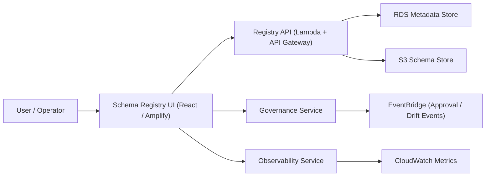

# Schema Registry — User Interface (UI)
> Context: Administrative Console • Owner: Platform Engineering • Last updated: 2025-10-07

## Purpose
Provide a unified, web-based **Schema Registry Console** that allows platform administrators, governance users, and tenant operators to manage schemas visually — from creation to validation, publishing, and drift monitoring.  
The UI integrates directly with the Schema Registry API, Governance Service, and Observability modules to provide full transparency, control, and operational readiness.

---

## Design Philosophy
- **Single Source of Truth:** The UI reflects real‑time data from the Registry API and Governance DB.  
- **AWS-Native Integration:** Hosted on **AWS Amplify** (React app) backed by **API Gateway + Lambda**.  
- **Separation of Concerns:** UI interacts only via APIs; no direct DB access.  
- **Secure by Design:** All API calls authenticated via **Cognito / IAM Federated Roles**.  
- **Operator‑centric:** Optimized for low-latency operations during validation, publishing, and drift review.  

---

## Architecture Overview

The UI communicates exclusively through REST and WebSocket channels with Registry APIs and backend services.  

---

## Core Features

| Feature | Description | Integrated AWS Service |
|---|---|---|
| **Schema Browser** | Search, filter, and inspect schema metadata and payloads | API Gateway + RDS |
| **Version Comparison** | Diff viewer for schema versions (field-level changes) | Registry API |
| **Validation Console** | Trigger on-demand validation and review logs | Lambda Validator |
| **Publishing Workflow** | Approve, reject, or schedule schema publish | Governance Service + EventBridge |
| **Drift Dashboard** | Monitor quarantines, drifts, and schema anomalies | Glue + CloudWatch |
| **Lineage Explorer** | Visualize schema‑to‑pipeline lineage | RDS + Observability API |
| **Audit & Logs** | Query audit trail and governance decisions | CloudTrail + RDS |
| **Metrics & Alerts** | Display real‑time pipeline and schema metrics | CloudWatch |

---

## User Roles and Access Controls
| Role | UI Permissions | Authentication Method |
|---|---|---|
| **schema-admin** | Full access to all schemas and governance actions | AWS Cognito / IAM Federated |
| **tenant-admin** | Manage tenant‑scoped schemas only | Cognito user pool group |
| **validator** | Execute validation and review logs | IAM role (assume via API) |
| **governance-approver** | Approve / reject publishing requests | Cognito + Governance API |
| **viewer** | Read-only schema browser and lineage explorer | Cognito guest group |

Access control is enforced through JWT claims from Cognito tokens and backend IAM policy mapping.

---

## Interaction Patterns

### Schema Lifecycle View
- Displays schema state machine (`draft → validated → published → deprecated`).  
- Inline actions for validation, version diff, and publish.  
- Badges and color codes:  
  - 🟢 Validated  
  - 🟡 Pending Approval  
  - 🔴 Drift Detected  

### Drift Dashboard
- Aggregates drift alerts from EventBridge and Glue.  
- Allows operator to acknowledge, quarantine, or trigger schema evolution.  
- Links to associated pipeline runs and S3 quarantine paths.

### Version Diff Viewer
- Field‑by‑field comparison between schema versions.  
- Highlights added / removed / modified fields.  
- Pulls data from Registry API diff endpoint.  

### Governance Approval Screen
- Displays pending schemas with full validation history and lineage context.  
- Approvers can digitally sign off using Cognito-authenticated credentials.  

---

## Observability Integration
| Metric Displayed | Data Source | Notes |
|---|---|---|
| `schema.validation_success_rate` | CloudWatch Metrics | Daily success trends |
| `schema.publish_latency_ms` | CloudWatch Metrics | Latency from draft → publish |
| `pipeline.drift_events` | EventBridge | Linked to Drift Dashboard |
| `registry.api_latency_ms` | CloudWatch Logs | Aggregated API performance |
| `validation.error_rate` | Lambda Validator Logs | Cross-filterable by tenant |

**Live Updates:** WebSocket subscription through API Gateway for `SchemaDriftDetected`, `SchemaPublished`, and `SchemaValidated` events.

---

## Security Controls
- Cognito-hosted login enforcing MFA.  
- Fine-grained IAM policies bound to Cognito user groups.  
- All API calls signed using AWS SigV4.  
- CSRF protection for POST/PUT requests.  
- Content-Security-Policy enforcing domain isolation.  
- CloudTrail captures all UI‑originated API actions.  

**Example Policy Snippet:**
```json
{
  "Effect": "Allow",
  "Action": [
    "execute-api:Invoke",
    "cloudwatch:GetMetricData"
  ],
  "Resource": "*"
}
```

---

## Deployment & Configuration
| Component | Service | Notes |
|---|---|---|
| **Frontend** | AWS Amplify (React) | Deployed via CI/CD pipeline |
| **Hosting** | Amazon S3 + CloudFront | HTTPS + caching enabled |
| **Auth** | Amazon Cognito | Integrated with internal IdP |
| **API** | API Gateway + Lambda | Connected via VPC links |
| **Monitoring** | CloudWatch + EventBridge | Log forwarding and alarms |

Deployment example:
```bash
amplify publish --env prod
aws cloudfront create-invalidation --distribution-id ABC123XYZ --paths "/*"
```

---

## Troubleshooting

| Issue | Symptom | Action |
|---|---|---|
| UI not loading schemas | API timeout | Check API Gateway latency, redeploy cache |
| Validation logs missing | Missing Lambda permission | Validate IAM policy for validator role |
| Drift dashboard empty | EventBridge rule misconfigured | Check rule pattern for `SchemaDriftDetected` |
| Audit trail not updating | Governance service delay | Inspect RDS and CloudTrail sync |

---

## Governance Notes
- All UI actions correspond to immutable audit entries in CloudTrail.  
- Schema deletions are **not permitted** from UI.  
- Governance approval and publishing require dual authorization.  
- Drift acknowledgment requires governance reference ticket.  

---

## Example Screens
1. **Schema Browser** — Table view with domain, version, status, last modified, and owner.  
2. **Validation Console** — Displays last run timestamp, error count, and log links.  
3. **Governance Dashboard** — List of pending approvals with schema lineage graph.  
4. **Drift Monitor** — Live feed of quarantined records with actions.

---

## References
- Amplify Frontend Config: `/infra/ui/schema_registry_amplify.yml`  
- CloudFront Policy: `/infra/ui/cloudfront_security_policy.json`  
- Cognito Auth Flow: `/infra/security/cognito_auth_diagram.md`  
- API Spec: `/api/v1/schema_registry_openapi.yaml`  
- Governance Events: `/events/schema_registry_events.json`

---
