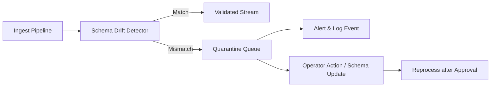

# Schema Registry — Schema Drift & Quarantine Management
> Context: Runtime Validation • Owner: Platform Engineering • Last updated: 2025-10-07

## Purpose
Define how the platform detects and handles **runtime schema drift** — when incoming data deviates from published schema definitions — and how such data is quarantined, observed, and remediated.

> Drift = data that violates current published schema contracts (e.g., new field, missing required field, type mismatch).

---

## Architecture Overview

The Drift Detector continuously validates live data batches or streams against published schemas.

---

## Drift Detection Rules
| Rule | Description | Action |
|---|---|---|
| Missing required field | Field absent in payload | Quarantine batch |
| Unexpected field | Field not defined in schema | Quarantine batch |
| Type mismatch | Actual type ≠ schema type | Quarantine batch |
| Constraint violation | Enum/regex/min/max fail | Quarantine record |
| Compatibility breach | Published schema replaced by incompatible version mid-run | Quarantine and halt |
| Unregistered schema | Data refers to unknown `fqid` | Reject batch |

---

## Quarantine Workflow
| Step | Action | Owner |
|---|---|---|
| 1 | Detector sends drift event | Platform Eng |
| 2 | Record routed to quarantine store (raw+metadata) | System |
| 3 | Alert generated with FQID + reason | Monitoring |
| 4 | Ops reviews event, decides reprocess or schema update | Platform Ops |
| 5 | Governance approves fix, schema version bump if needed | Governance |
| 6 | Quarantined data revalidated and merged | Pipeline |

**Storage Location:**  
`s3://warehouse/quarantine/{domain}/{subject}/event_date={YYYY-MM-DD}/`

---

## Observability
| Metric | Description | Unit | Target |
|---|---|---|---|
| `drift.detected_count` | Total drift events | count/day | 0 |
| `drift.unique_fqids` | Schemas affected | count/day | trend |
| `quarantine.size_gb` | Data held in quarantine | GB | monitored |
| `quarantine.resolution_sla_pct` | Resolved within SLA | % | ≥95 |

**Events**  
`SchemaDriftDetected`, `SchemaQuarantined`, `SchemaReprocessed`

---

## Error Catalog
| Code | Condition | Operator Action |
|---|---|---|
| DRF-1001 | Missing field | Fix extractor or add optional field |
| DRF-1102 | Unknown field | Ignore or evolve schema |
| DRF-1203 | Type mismatch | Adjust mapping or schema type |
| DRF-1304 | Constraint violation | Correct data at source |
| DRF-1401 | Schema version conflict | Freeze version during ingest |
| DRF-1501 | Unregistered schema | Register and validate schema first |

---

## Governance Notes
- Quarantine data is immutable; only new validated batches may overwrite.  
- Operators MUST record resolution reason and link to CR ticket.  
- Schema changes from drift must pass full validation and governance.  
- Drift statistics are included in weekly observability reports.

---

## Example
### Example — GDP Payment Drift Detection
Incoming payload missing `payment_date`.  
- Detector flags drift for `finance.gdp.payment:v1.0`.  
- Record quarantined; operator adds optional field proposal.  
- Governance approves `v1.1` with `payment_date` optional.  
- Reprocessing clears quarantine. ✅

---
