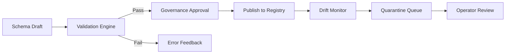

# Schema Registry — Validation Overview
> Context: Validation Framework • Owner: Platform Engineering • Last updated: 2025-10-07

## Purpose
Provide a unified view of the **Validation Framework** governing schema and data quality within the platform.  
Validation ensures every schema — from Extractor to KPI — adheres to defined contracts, remains backward compatible, and enforces governance standards before and after publication.

> **Context separation:**  
> - Lifecycle Validation → governs *when and who* validates schemas.  
> - Envelope & Payload Validation → defines *how* technical rules are enforced.  
> - Drift & Quarantine → handles *runtime deviations* during data ingestion.

---

## Architecture Overview

Validation spans **design‑time** (schema correctness) and **runtime** (data conformity).

---

## Objectives
- Guarantee **schema integrity** before publication.  
- Prevent **breaking changes** across versions.  
- Detect **schema drift** in live pipelines early.  
- Enforce **auditability** and **observability** at each step.  
- Support **multi‑tenant isolation** via namespaced validation contexts.

---

## Validation Layers
| Layer | Scope | Timing | Responsibility |
|---|---|---|---|
| Lifecycle | Governance workflow (draft → validated → published) | Design-time | Platform Ops |
| Envelope & Payload | Schema syntax, structure, semantics | Design-time | Platform Eng |
| Drift & Quarantine | Runtime data vs. published schema | Runtime | Platform Eng / Ops |

---

## Integration Points
| Stage | Input | Engine | Output |
|---|---|---|---|
| Draft Save | JSON schema draft | Meta‑Schema Engine | Error list |
| Version Bump | Existing schema + new | Compatibility Engine | diff classification |
| Publish | Validated schema | Governance Engine | Immutable publish |
| Runtime Ingest | Data record | Drift Detector | valid / quarantined |

---

## Observability
| Metric | Description | Unit | Target |
|---|---|---|---|
| `validation.success_rate` | Successful validations / total | % | >99 |
| `validation.latency_ms` | Schema validation time | ms | P95 ≤ 500 |
| `drift.detected_count` | Runtime drift events | count/day | 0 |
| `quarantine.resolved_pct` | Records resolved within SLA | % | ≥95 |

---

## Governance Notes
- Validation engines are **mandatory for all schema types** before publication.  
- Governance approval is **blocked** if validation fails or incomplete lineage.  
- Audit events (`SchemaValidated`, `SchemaDriftDetected`) are recorded to the ledger.  
- Tenant variants are validated within their namespace to avoid cross‑impact.

---

## Examples
### Example — Validation Flow Summary
1. Author submits `finance.gdp.invoice:v1.1`.  
2. Envelope & Payload engine checks structure → passes.  
3. Compatibility check detects backward‑safe change.  
4. Governance marks schema as `validated`.  
5. Schema is published and begins runtime drift monitoring.

---
