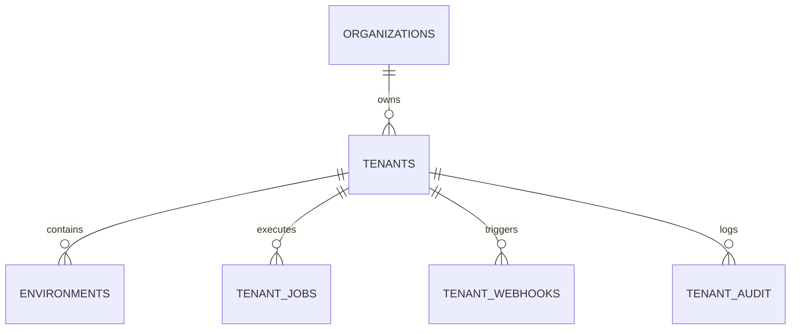

# Tenancy Module - Data Models
## File: tenancy-db-schema.md

Audience: Database architects, backend developers  
Status: Draft v0.1  
Purpose: Defines the relational schema for the tenancy module. Describes core tables, relationships, and key fields supporting tenant registration, lifecycle, and environment management.

---

## 1. Design Principles

1. Each tenant is a unique entity identified by a global `tenant_id`.
2. Multi-tenant (MT) and Single-tenant (ST) profiles share the same logical schema with profile-specific attributes.
3. Environment records are versioned and linked to the parent tenant for isolation and policy enforcement.
4. Quotas, policies, and billing data are stored in JSON columns for flexibility.
5. Lifecycle transitions are tracked through an audit table with correlation identifiers.

---

## 2. Core Tables

### 2.1 tenants
| Column | Type | Description |
|--------|------|-------------|
| tenant_id | varchar(64) | Unique tenant identifier |
| organization_id | varchar(64) | Owning organization |
| profile | varchar(32) | mt-standard or st-dedicated |
| state | varchar(32) | Draft, Active, Suspended, Archived |
| region | varchar(64) | Cloud region for deployment |
| quotas | jsonb | Storage, compute, concurrency limits |
| policies | jsonb | Residency, encryption, retention rules |
| billing | jsonb | Plan type, cost center, billing references |
| created_at | timestamp | Creation time |
| updated_at | timestamp | Last modification |
| version | integer | Incremented per manifest update |

Indexes  
- PK: tenant_id  
- IDX: organization_id, state, region

---

### 2.2 environments
| Column | Type | Description |
|--------|------|-------------|
| env_id | varchar(64) | Unique environment identifier |
| tenant_id | varchar(64) | Foreign key to tenants |
| name | varchar(32) | dev, stage, prod |
| region | varchar(64) | Deployment region |
| isolation_level | varchar(32) | strict, shared |
| quotas | jsonb | Environment level limits |
| retention_days | integer | Data retention window |
| created_at | timestamp | Creation time |
| updated_at | timestamp | Last modification |

Indexes  
- PK: env_id  
- FK: tenant_id  
- IDX: tenant_id, name

---

### 2.3 tenant_audit
| Column | Type | Description |
|--------|------|-------------|
| audit_id | varchar(64) | Unique event id |
| tenant_id | varchar(64) | Foreign key to tenants |
| event_type | varchar(64) | TENANCY_CREATED, TENANCY_ACTIVATED, etc |
| actor | varchar(64) | user, system, controller |
| payload | jsonb | Event details |
| correlation_id | varchar(64) | Request tracking id |
| occurred_at | timestamp | Event timestamp |

Indexes  
- PK: audit_id  
- FK: tenant_id  
- IDX: event_type, occurred_at

---

### 2.4 tenant_jobs
| Column | Type | Description |
|--------|------|-------------|
| job_id | varchar(64) | Lifecycle job identifier |
| tenant_id | varchar(64) | Related tenant |
| action | varchar(64) | create, activate, suspend, delete |
| state | varchar(32) | queued, running, completed, failed |
| progress | float | Fractional completion |
| logs | text | Controller logs snapshot |
| created_at | timestamp | Job creation time |
| updated_at | timestamp | Last modification |

Indexes  
- PK: job_id  
- IDX: tenant_id, state

---

### 2.5 tenant_webhooks
| Column | Type | Description |
|--------|------|-------------|
| webhook_id | varchar(64) | Unique id |
| tenant_id | varchar(64) | Foreign key to tenants |
| url | text | Destination endpoint |
| events | jsonb | Subscribed events |
| secret | text | Shared secret |
| retry_policy | jsonb | Backoff, max retries |
| created_at | timestamp | Created |
| updated_at | timestamp | Updated |

Indexes  
- PK: webhook_id  
- FK: tenant_id

---

## 3. Relationships

- One organization → many tenants  
- One tenant → many environments  
- One tenant → many jobs, webhooks, and audit entries


---

## 4. JSON Structures

Example of `quotas` JSON:
```
{
  "storageGiB": 500,
  "concurrentJobs": 10,
  "apiRateLimit": 200
}
```

Example of `policies` JSON:
```
{
  "dataResidency": "in-region-only",
  "encryption": "kms-per-tenant",
  "retentionDays": 365
}
```

---

## 5. Schema Evolution

- Version column in tenants table supports optimistic concurrency.  
- Schema migrations are registered in Schema-Registry per tenant and environment.  
- Deprecated columns are soft-retired with view redirection until next migration cycle.

---

Summary  
This schema defines the core persistence layer for tenancy management. It is optimized for relational consistency with JSON flexibility for evolving metadata and configurations.
