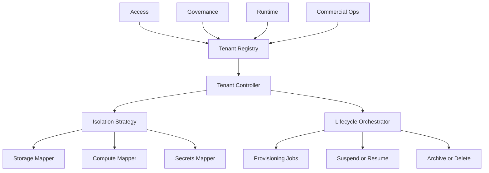

# Tenancy Module - Architecture

Audience: Platform engineers, solution architects, SRE  
Status: Refactor v1.0  
Purpose: Describe the logical architecture of Tenancy and how it provides isolation, identity, and lifecycle across multi tenant and single tenant profiles. Security controls from the former Host Tenant Management are folded in here.

---

## 1. Position in the platform

Tenancy is the control plane for where workloads run, how data is isolated, and what policies apply. Every subsystem consumes a tenant scoped context that includes identifiers, policy, topology, quotas, and environment. The same context is used in both multi tenant and single tenant deployments.

---

## 2. Objectives

- Isolation by design across storage, compute, network, and secrets  
- Equal support for multi tenant and single tenant without branching code  
- Declarative lifecycle through manifests and idempotent controllers  
- Full auditability for every change and action  
- Stable integration points for Access, Governance, Commercial Ops, Runtime, and Schema Registry

---

## 3. Deployment profiles

### 3.1 Multi tenant
Use when you need fast onboarding and efficient cost. Isolation is logical using schemas, namespaces, IAM, and per tenant encryption contexts. Noise is controlled with quotas, rate limits, and separate workload queues.

### 3.2 Single tenant
Use when you require strict isolation or regional placement by policy. Isolation is physical or logical at VPC, database, object store, and runtime worker pools. Change windows and upgrades can be tenant specific.

Tenant context is identical in both profiles. The isolation strategy and resource mapping differ.

---

## 4. Logical components

- Tenant Registry. Source of truth for identity, metadata, policy, and state  
- Tenant Controller. Reconciles desired state from manifests into resources  
- Isolation Strategy. Pluggable layer that maps tenant context to resources  
- Resource Mappers. Storage, compute, secrets, and network mappers  
- Lifecycle Orchestrator. Workflows for provision, suspend, archive, delete  
- Event bus and webhooks. Publish lifecycle and policy events to consumers

Explanation  
The registry stores immutable identifiers and mutable attributes. The controller reads manifest input and reconciles it using the selected isolation strategy. The orchestrator executes workflows and pushes progress to a job resource.

---

## 5. Isolation strategy

Interface with two first class implementations.

- Strategy MT  
  - Database. Schema or database per tenant with strict roles  
  - Object store. Per tenant prefixes with per tenant encryption keys  
  - Runtime. Per tenant queues or namespaces with limits

- Strategy ST  
  - Database. Dedicated database or cluster per tenant with network separation  
  - Object store. Bucket per tenant with policy scoped keys  
  - Runtime. Dedicated worker pools with independent autoscaling

Selector  
A profile on the tenant decides the strategy. Profiles include mt standard, st dedicated, and st byoc.

---

## 6. Resource mapping examples

| Resource | Multi tenant | Single tenant |
|---|---|---|
| Database | warehouse.shared with schema t_{id} | warehouse_{id} |
| Object store | data.shared with prefix tenants/{id} | data-{id} |
| Runtime | queue jobs with partition key {id} | queue jobs-{id} |
| Secrets | secrets/{id}/* with unique keys | secrets/{id}/* with dedicated KMS and policy |
| Network | shared VPC and per environment NSG | VPC per tenant and environment |

---

## 7. Security posture

The security section from Host Tenant Management is now authoritative here.

Ownership boundaries  
- Tenancy stores tenant identity and metadata only  
- Application data and secrets belong to other modules

Data classification and retention  
- Contact information and external identifiers are sensitive  
- Audit entries are append only and retained per policy

Protection controls  
- TLS for all API calls and private endpoints for data planes  
- Encryption at rest for all persistence layers  
- Per tenant encryption contexts for storage and object keys  
- Least privilege IAM with resource level constraints  
- Rate limits on authoring routes and quotas per tenant

Auditability  
- Every write produces an audit record with actor, action, target, correlation id, and timestamp  
- Events are signed and delivered to Governance and to configured webhooks

Incident hooks  
- Correlate incidents using correlation id across services  
- Use Runbook and Troubleshooting for procedures and mitigations

---

## 8. Lifecycle integration

Lifecycle is defined in Tenant Life Cycle and is not repeated here. When a transition occurs, the controller validates policies with Governance, applies resource changes through the selected strategy, and emits events and job progress updates.

---

## 9. Configuration surfaces

- Tenant manifest for desired state and profile selection  
- Controller configuration for reconciliation intervals, retries, and concurrency  
- Policy registry for residency, encryption, retention, and plan checks

See Configuration for schemas and examples.

---

## 10. Cross module contracts

- Access. Resolve role bindings and validate tenant scope before issuing tokens  
- Commercial Ops. Receive usage reports and enforce plan limits during operations  
- Governance. Receive lifecycle and policy events and return enforcement results  
- Runtime. Request topology and execution limits per tenant and environment  
- Schema Registry. Apply migration sets per tenant and environment

---

## 11. Invariants

- Tenant identifiers and metadata model remain the same across profiles  
- API and event schema remain stable across releases  
- Audit and observability hooks are mandatory for every change

---

Summary  
Tenancy provides a single tenant contract across multi tenant and single tenant deployments. Isolation is selected by strategy under a common control plane. Security and audit controls are built in and are the source of truth for downstream modules.

---

## Design and Security Notes Restored

- # Tenancy Module — Architecture > **Audience:** Platform engineers, solution architects, SRE > **Status:** Draft v0.1 (self-contained deep brief) > **Summary:** This document defines the architecture of the Tenancy module and describes how the platform delivers both **multi-tenant (shared)** and **single-tenant (dedicated)** deployment profiles without fragmenting the codebase or operational model.
- Why Tenancy is the Control Plane Tenancy is not an access convenience; it is the *control plane* that determines where and how workloads execute, how data is isolated, which configurations apply, and how lifecycle events are governed.
- Without a formal tenancy model, isolation drifts into ad‑hoc tables, prefixes, and IAM hacks that do not scale across customers or environments.
- This module provides one **canonical contract** that every subsystem consumes: *a tenant-scoped context* (IDs, policy, topology, quotas).
- All provisioning, orchestration, schema changes, metric collection, and billing flows are **tenant-aware by default**.
- Design Objectives - **Isolation by design.** Enforce hard boundaries for data, compute, and configuration.
- - **Dual deployment profiles.** Support **Multi‑Tenant (MT)** and **Single‑Tenant (ST)** **without duplicating code**.
- - **Declarative lifecycle.** Tenants are created/changed through manifests and idempotent controllers.
- - **Auditability.** Every tenant mutation emits a governance event with immutable IDs.
- - **Composability.** Downstream modules (Access, Governance, Schema, Runtime, Commercial‑Ops) consume the same tenant context API.
- Deployment Profiles (Two Options, One Model) We offer two deployment profiles.
- They share the **same logical model** and **API surface**.
- The difference is the **isolation strategy layer** and **resource mapping**.
- ### 3.1 Multi‑Tenant (MT, shared infra) - **Use case.** Fast onboarding, cost efficiency for SMB/MSE, burstable workloads.
- - **Isolation.** Logical isolation via namespace/schema per tenant; strict IAM policies; per‑tenant encryption contexts and secrets.
- - **Blast radius.** Strictly limited through per‑tenant quotas, rate limits, and workload queues.
- - **Trade‑offs.** Lower cost, higher density; requires stronger guardrails to avoid noisy neighbors.
- ### 3.2 Single‑Tenant (ST, dedicated infra) - **Use case.** Regulated industries, strict data residency, bespoke SLAs, bring‑your‑own‑cloud.
- - **Isolation.** Physical/logical separation at VPC, database, and object store; dedicated runtime workers.
- - **Blast radius.** Tenant failures are fully contained; change windows can be negotiated independently.
- - **Trade‑offs.** Higher cost; more infra to manage; slower fleet‑wide updates.
- > **Principle:** The **Tenant Context** (ID, policy, topology) is identical in both profiles.
- Only the **Isolation Strategy** and **Resource Mapping** differ.
- Logical Architecture **Explanation.** The **Tenant Registry** is the source of truth (immutable IDs, metadata, policy).
- The **Tenant Controller** reconciles desired state from manifests into actual resources via the **Isolation Strategy** and **Mappers** (storage/compute/secrets).
- The **Lifecycle Orchestrator** executes workflows (provision, suspend, archive).
- Isolation Strategy (Pluggable Layer) The isolation layer is a **strategy interface** with two built‑in implementations.
- Additional strategies can be added without changing callers.
- - `IsolationStrategyMT` (shared): - DB: per‑tenant schema or database; strict roles; row‑level policies optional but discouraged.
- - Object store: `s3://bucket/tenants/{tenant_id}/...` with per‑tenant KMS keys.
- - Runtime: per‑tenant queues or namespaces; concurrency and rate limits per tenant.
- - `IsolationStrategyST` (dedicated): - DB: dedicated cluster or database per tenant; network‑level separation (VPC/VNet).
- - Object store: dedicated bucket/prefix with tenant‑scoped KMS keys and bucket policies.
- - Runtime: dedicated worker pool; isolated autoscaling.
- **Selector.** The strategy is chosen by policy on the **Tenant Profile** (e.g., `profile: mt-standard | st-dedicated | st-byoc`).
- Resource Mapping (Examples) | Resource | MT (shared) | ST (dedicated) | |---|---|---| | Database | `warehouse.shared` → schema `t_{id}` | `warehouse_{id}` (cluster/db per tenant) | | Object Store | Bucket `data.shared` → prefix `/tenants/{id}` | Bucket `data-{id}` | | Runtime | Queue `jobs` → partition key `{id}` | Queue `jobs-{id}` | | Secrets | `secrets/{id}/*` | `secrets/{id}/*` (but isolated KMS + access path) | | Network | Shared VPC; NSG per env | VPC per tenant/env | --- ## 7.
- Tenant Lifecycle (Event-Driven) **State changes** are idempotent; retries are safe.
- *Suspend* freezes runtime and access; *Archive* moves data to cold storage; *Delete* enforces retention policies.
- Data & Compute Isolation Rules - **No cross‑tenant joins** in MT; service boundaries prevent accidental leakage.
- - **Per‑tenant encryption contexts** (KMS keys and audit trails) regardless of profile.
- - **Access module** resolves identities to `(tenant_id, env)` before issuing tokens.
- - **All APIs require tenant scope**; server‑side validates against the registry.
- - **Observability tags** always include `{tenant_id, env, region}` for filtering and cost allocation.
- Configuration Surfaces - **Manifest (declarative):** - **Controller flags (operational):** enable/disable strategies, default quotas, safety limits.
- - **Policy registry:** links compliance obligations (retention, residency) to tenants.
- Cross‑Module Contracts - **Access:** role bindings are tenant‑scoped; admin roles may span envs, not tenants.
- - **Schema‑Registry:** migration sets are referenced as `(tenant_id, env, app_version)`.
- - **Runtime/Orchestrator:** queue names or partitions are derived from `(tenant_id, env)`.
- - **Commercial‑Ops:** usage meters emit `{tenant_id, resource, amount, ts}`.
- - **Governance:** all controller actions emit `TENANCY_*` events with immutable IDs.
- Scaling & Failure Domains - **MT:** scale via sharding (by tenant hash) and horizontal autoscaling of workers; noisy neighbors mitigated with per‑tenant quotas and back‑pressure.
- - **ST:** scale by adding dedicated nodes/workers; change windows and upgrades can be tenant‑specific.
- - **Controller resilience:** reconciliation loops are idempotent; partial failures requeue with exponential backoff.
- Security Posture - **Least privilege IAM** with resource‑level constraints.
- - **Per‑tenant secrets** with rotation policies and break‑glass procedures.
- - **Network isolation**: private endpoints; no public data planes.
- - **Audit completeness**: every create/update/delete produces signed governance records.
- Trade‑Offs and Decision Guide - Choose **MT** when cost efficiency and fast provisioning dominate and compliance allows shared substrates.
- - Choose **ST** when residency, isolation, or bespoke SLAs are non‑negotiable.
- - Migration path exists: **MT→ST** by replaying the tenant manifest with an ST profile; data is rehydrated into dedicated resources with a cutover window.
- What Stays Invariant (Regardless of Option) - Tenant IDs and metadata model.
- - Governance, billing, and observability integration points.
- - Declarative lifecycle via manifests and reconciliation.
- --- **Outcome:** By treating isolation as a pluggable strategy underneath a single tenant contract, the platform can support both Multi‑Tenant and Single‑Tenant customers without duplicating services or fragmenting developer workflows.
