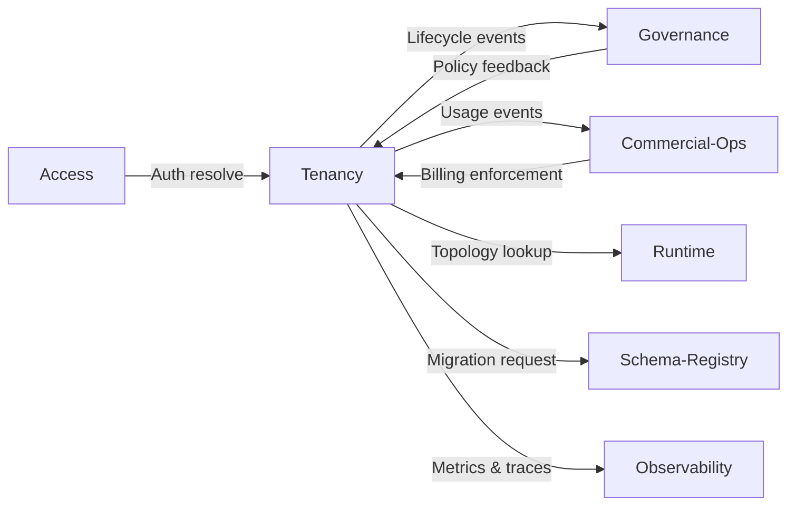

# Tenancy Module - Integration

Audience: System integrators, module owners, platform engineers  
Status: Draft v0.1  
Purpose: Describes how the Tenancy module integrates with other platform components and external systems. Covers event flows, data exchange formats, and dependency contracts.

---

## 1. Integration Philosophy

The Tenancy module acts as the identity and isolation anchor for every operation on the platform. It is not a peripheral service but the root context that other modules depend on for safe execution.

Integration follows three principles:
1. Single source of truth for tenant and environment identities.
2. Event-driven interoperability across internal services.
3. API-first design with stable contracts and minimal coupling.

---

## 2. Core Integration Contracts

Each module interacts with Tenancy through either a direct API or an event stream. The contracts are defined around identity propagation, isolation enforcement, and audit compliance.

| Module | Integration Type | Key Artifacts |
|---------|------------------|----------------|
| Access | REST API and event stream | Tenant context lookup, role binding validation |
| Governance | Event stream and policy registry | Lifecycle audit, compliance rules, residency enforcement |
| Commercial-Ops | REST API and usage events | Billing linkage, quota enforcement |
| Runtime/Orchestrator | REST API and topology discovery | Queue and worker provisioning |
| Schema-Registry | REST API | Migration application per tenant |
| Observability | Event stream | Metrics, cost tracking, anomaly detection |

---

## 3. Integration with Access Module

Purpose: Bind user authentication and authorization to a tenant scope.

Flow:
1. A user authenticates via Access.  
2. Access module queries Tenancy to resolve tenantId, env, and associated role bindings.  
3. Access enforces authorization based on tenancy metadata and policies.  
4. Audit events are generated by both Access and Tenancy for traceability.

API Reference:
```
POST /api/tenancy/v1/access/resolve
```

Returned attributes:
- tenantId  
- env  
- effectiveRoles  
- scopeValidity

Access caches resolution for short intervals (default 5 minutes) to improve latency.

---

## 4. Integration with Governance Module

Purpose: Maintain a compliance ledger for every lifecycle event and policy binding.

Flow:
1. Tenancy emits lifecycle events (create, activate, suspend, archive, delete).  
2. Governance ingests and validates the event payload.  
3. Policy evaluation occurs before lifecycle transitions complete.  
4. Governance sends enforcement results back to Tenancy.  

Example event payload:
```json
{
  "type": "TENANCY_SUSPENDED",
  "tenantId": "t_7f3c2a",
  "env": "prod",
  "reason": "billing",
  "occurredAt": "2025-10-08T16:45:00Z"
}
```

Tenancy enforces policy outcomes in real time. For example, a failed retention validation blocks deletion until policy override.

---

## 5. Integration with Commercial-Ops Module

Purpose: Align usage, billing, and plan enforcement with tenant lifecycle.

Flow:
1. Tenancy emits usage events for compute, storage, and API calls.  
2. Commercial-Ops ingests usage and maps it to the correct billing plan.  
3. Plan limits are validated before provisioning or scale-up operations.  
4. Billing reconciliation jobs correlate Tenancy and Commercial-Ops records daily.

Example usage event:
```json
{
  "tenantId": "t_7f3c2a",
  "resource": "storageGiBHours",
  "amount": 128.4,
  "timestamp": "2025-10-08T16:40:00Z"
}
```

---

## 6. Integration with Runtime and Orchestrator

Purpose: Provide tenant-specific execution contexts for workloads.

Flow:
1. Runtime requests topology details from Tenancy.  
2. Tenancy returns the resource map for the tenant and environment.  
3. Runtime submits jobs into tenant-bound queues.  
4. Worker nodes apply tenant metadata to all telemetry and cost allocation tags.

Topology API example:
```
GET /api/tenancy/v1/tenants/{tenantId}/topology?env=prod
```

Returned:
```json
{
  "db": {"type": "postgres", "schema": "t_7f3c2a"},
  "queue": {"name": "jobs", "partitionKey": "t_7f3c2a"},
  "objectStore": {"bucket": "data.shared", "prefix": "tenants/t_7f3c2a/prod"}
}
```

---

## 7. Integration with Schema-Registry

Purpose: Manage schema changes consistently across tenants and environments.

Flow:
1. When a tenant is created or upgraded, Tenancy notifies Schema-Registry.  
2. Schema-Registry applies the correct migration set for that tenant and environment.  
3. Tenancy records migration results for audit.  

API Example:
```
POST /api/tenancy/v1/schema/migrations
Body:
{
  "tenantId": "t_7f3c2a",
  "env": "prod",
  "appVersion": "2.3.0",
  "migrationSetId": "ms_9821"
}
```

---

## 8. Integration with Observability

Purpose: Correlate tenant activity, costs, and performance metrics.

Mechanism:
- Tenancy publishes metrics with tags {tenantId, env, region}.  
- Observability aggregates data for dashboards and anomaly alerts.  
- Alerts referencing tenant IDs are routed to the respective account owners.

Example metric:
```
tenancy_controller_reconcile_seconds{tenantId="t_7f3c2a", env="prod"} 2.34
```

---

## 9. Integration with External Systems

Tenancy may expose limited integration points for partner systems or external billing connectors.

Supported external interfaces:
- Webhooks: Lifecycle notifications to partner endpoints.  
- Event streams: Kafka-compatible topics for consumption by third-party services.  
- Federation API: For organizations operating across multiple regional tenancy controllers.

Webhook configuration:
```
POST /api/tenancy/v1/webhooks
Body:
{
  "url": "https://partner.example.com/hooks/tenancy",
  "events": ["TENANCY_ACTIVATED", "TENANCY_SUSPENDED"],
  "secret": "whsec_..."
}
```

---

## 10. Data Flow Overview



---

## 11. Failure Handling

- All integration calls are idempotent and retried with exponential backoff.  
- Events are durable; missed deliveries are replayed by sequence number.  
- Dead-letter queues capture unprocessed messages.  
- Integrations must handle eventual consistency within 30 seconds of latency.

---

## 12. Security and Access Control

- All calls require tenant-scoped access tokens.  
- Each module has its own service principal with least privilege.  
- Cross-module secrets are rotated automatically through Secrets Manager.  
- Webhooks and streams use signed messages for authenticity.  

---

## 13. Observability and Auditing

- Every API call and event emission includes a correlation identifier.  
- Audit trails from all integrations feed into Governance.  
- Observability metrics include reconciliation duration, webhook latency, and failed event counts.

---

## 14. Integration Checklist

| Area | Requirement |
|-------|--------------|
| Authentication | Access tokens validated by Access service |
| Idempotency | Request ID enforced for all write operations |
| Retry logic | Exponential backoff with max retry 8 |
| Event replay | Supported for all lifecycle events |
| Schema versioning | API version and event version tracked independently |
| Encryption | All communication over TLS 1.2 or higher |
| Monitoring | Metrics exported with tenant tags |

---

Summary  
The Tenancy module is the integration backbone of the platform. Every subsystem relies on its identifiers, policies, and lifecycle events to remain consistent. Integrations must treat Tenancy as the authoritative context layer and align their operations accordingly.
