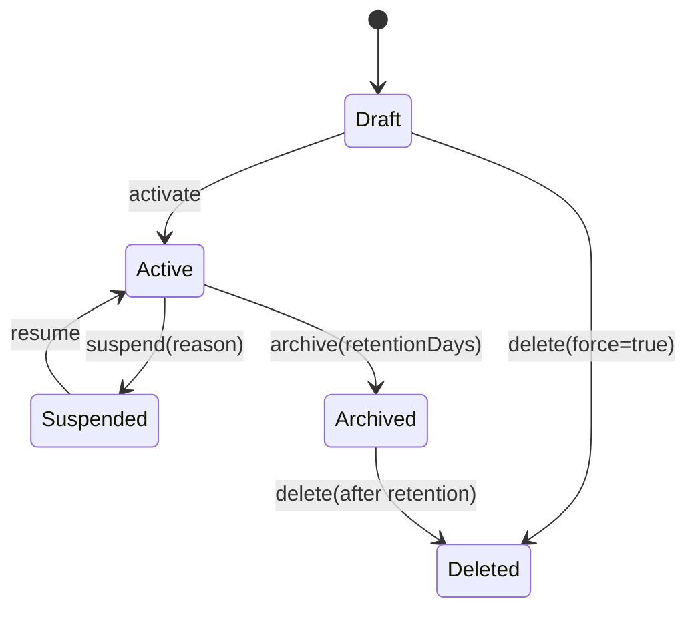

# Tenancy Module - Tenant Life Cycle

Audience: Platform engineers, SRE, solution architects  
Status: Draft v0.1  
Purpose: Defines the tenant life cycle as a first class concept inside the Tenancy module. This consolidates earlier Host tenant management material into a single, authoritative document. It covers states, transitions, preconditions, postconditions, events, failure modes, and operational runbooks.

---

## 1. Life cycle overview

A tenant moves through a predictable set of states. Each transition is initiated by an API call or a manifest and is reconciled by the controller. All transitions are idempotent and emit governance events.

States
- Draft  
- Active  
- Suspended  
- Archived  
- Deleted

High level rules
- A tenant can only be Active after provisioning completes and policy checks pass  
- Suspension restricts access without data loss  
- Archival removes active compute while retaining data for the retention window  
- Deletion is only allowed after retention criteria are met

---

## 2. State machine



Operational notes
- Idempotent retries are safe for all transitions  
- Some transitions require external approvals from Governance  
- Controller publishes progress to a job resource until completion

---

## 3. Transitions in detail

### 3.1 Activate
Purpose  
Provision resources and enable the tenant for operation.

Preconditions  
- Tenant exists in Draft  
- Policy checks pass  
- Capacity and quotas are available

Actions  
- Allocate storage, secrets, runtime queues, and credentials  
- Apply schema migrations for each environment  
- Register usage meters and webhook subscriptions

Postconditions  
- Tenant state is Active  
- Topology discovery returns full resource map  
- Governance records TENANCY_ACTIVATED event

APIs  
```
POST /api/tenancy/v1/tenants/{tenantId}:activate
GET  /api/tenancy/v1/jobs/{jobId}
```

### 3.2 Suspend
Purpose  
Temporarily restrict tenant operations without data deletion.

Preconditions  
- Tenant is Active  
- Reason is provided such as billing or security

Actions  
- Disable access tokens at Access module  
- Quiesce runtime queues  
- Optionally enable read only access for audit users

Postconditions  
- Tenant state is Suspended  
- Governance records TENANCY_SUSPENDED event

APIs  
```
POST /api/tenancy/v1/tenants/{tenantId}:suspend
```

### 3.3 Resume
Purpose  
Re enable operations after a suspension.

Preconditions  
- Tenant is Suspended  
- Root cause for suspension is cleared

Actions  
- Re enable tokens and runtime queues  
- Validate policy bindings have not changed

Postconditions  
- Tenant returns to Active  
- Governance records TENANCY_RESUMED event

APIs  
```
POST /api/tenancy/v1/tenants/{tenantId}:resume
```

### 3.4 Archive
Purpose  
Shut down compute and move data to cold storage while retaining it for compliance.

Preconditions  
- Tenant is Active or Suspended  
- Retention policy exists

Actions  
- De provision workers and ephemeral compute  
- Seal credentials and rotate secrets to archival roles  
- Transition storage classes to cold tiers

Postconditions  
- Tenant state is Archived  
- Governance records TENANCY_ARCHIVED event

APIs  
```
POST /api/tenancy/v1/tenants/{tenantId}:archive
```

### 3.5 Delete
Purpose  
Permanently remove tenant resources after the retention window.

Preconditions  
- Tenant is Archived or Draft with force  
- Retention window has expired or force is allowed by policy

Actions  
- Purge data and secrets  
- Tear down buckets, schemas, queues, and webhooks  
- Finalize audit trail

Postconditions  
- Tenant state is Deleted  
- Governance records TENANCY_DELETED event

APIs  
```
POST /api/tenancy/v1/tenants/{tenantId}:delete
DELETE /api/tenancy/v1/tenants/{tenantId}?force=true
```

---

## 4. Events and auditing

Every transition emits an event. Events are signed and published to the governance stream and to configured webhooks.

Common event fields
- type  
- tenantId  
- env when applicable  
- occurredAt  
- actor  
- correlationId  
- metadata

Lifecycle events
- TENANCY_CREATED  
- TENANCY_ACTIVATED  
- TENANCY_SUSPENDED  
- TENANCY_RESUMED  
- TENANCY_ARCHIVED  
- TENANCY_DELETED

Example
```json
{
  "type": "TENANCY_ARCHIVED",
  "tenantId": "t_7f3c2a",
  "occurredAt": "2025-10-08T16:45:00Z",
  "actor": "controller",
  "metadata": {"retentionDays": 365},
  "correlationId": "3b1a2d..."
}
```

---

## 5. Policy checks and approvals

Before transitions that change data durability or accessibility, the controller requests policy validation from Governance.

Policy groups
- Data residency  
- Encryption standard  
- Retention window  
- Billing plan and quota eligibility

Approvals
- Automatic for low risk changes  
- Manual for reductions in durability or cross region moves

Failure handling
- Transition is blocked and the job state moves to Failed with details  
- A governance event with denial reason is recorded

---

## 6. Topology implications

Each transition drives a change in topology and credentials.

Activate  
- Creates or assigns database schema or database  
- Creates object store prefixes or buckets  
- Provisions runtime queue namespace  
- Issues secrets for applications and operators

Suspend  
- Marks credentials read only or disables them  
- Pauses queues and blocks new submissions

Archive  
- Moves storage classes to cold tiers  
- Revokes runtime credentials and disables compute

Delete  
- Purges resources and removes topology entries

---

## 7. Rollback and retries

All transitions are idempotent. Partial failures are retried with exponential backoff. The controller maintains a job record with progress and last error.

Rollback guidance  
- If activation fails late, issue delete with force to clean partial resources then re apply the manifest  
- If archive fails, resume to Active, resolve policy or capacity, then retry archive

---

## 8. MT to ST migration flow

Purpose  
Move a tenant from shared infrastructure to dedicated infrastructure without data loss.

Steps  
1. Patch tenant profile to st-dedicated  
2. Controller provisions dedicated resources and begins delta sync  
3. Enter short read only window for cutover  
4. Flip topology to dedicated resources  
5. Decommission shared resources after verification

Risks  
- Client caches may hold old resource paths  
- Missed final deltas if read only is not enforced

Mitigations  
- Broadcast topology change via webhook and event stream  
- Force clients to refresh credentials and topology

---

## 9. Operational metrics

- tenancy_lifecycle_transition_seconds  
- tenancy_lifecycle_failures_total  
- tenancy_policy_denials_total  
- tenancy_state_counts by state  
- tenancy_topology_issuance_seconds

Alerts
- Activation job running longer than threshold  
- Repeated policy denials for the same tenant  
- Archive completion lag rising above baseline

---

## 10. API summary

Transition endpoints
- POST /api/tenancy/v1/tenants/{tenantId}:activate  
- POST /api/tenancy/v1/tenants/{tenantId}:suspend  
- POST /api/tenancy/v1/tenants/{tenantId}:resume  
- POST /api/tenancy/v1/tenants/{tenantId}:archive  
- POST /api/tenancy/v1/tenants/{tenantId}:delete  
- GET  /api/tenancy/v1/jobs/{jobId}

Headers
- X Tenant Id  
- X Env  
- X Request Id  
- Authorization

---

## 11. Migration note for repository

If you previously documented tenant management under Host, relocate conceptual and procedural content into this document. Keep a short stub under Host that links here and to the Tenancy APIs. Remove the old folder after one release cycle with redirects in place.

---

Summary  
This document formalizes tenant life cycle as a single source of truth inside the Tenancy module. It defines states, transitions, events, and operational behaviors so that all dependent modules implement consistent behavior and traceability.
