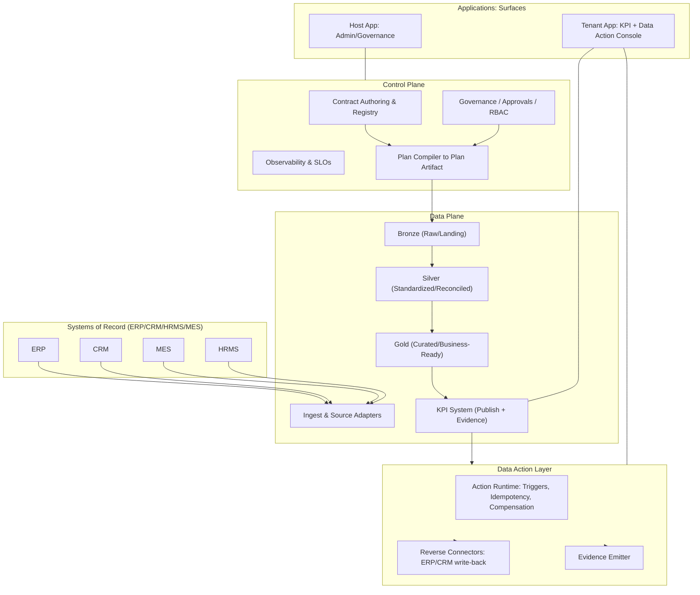
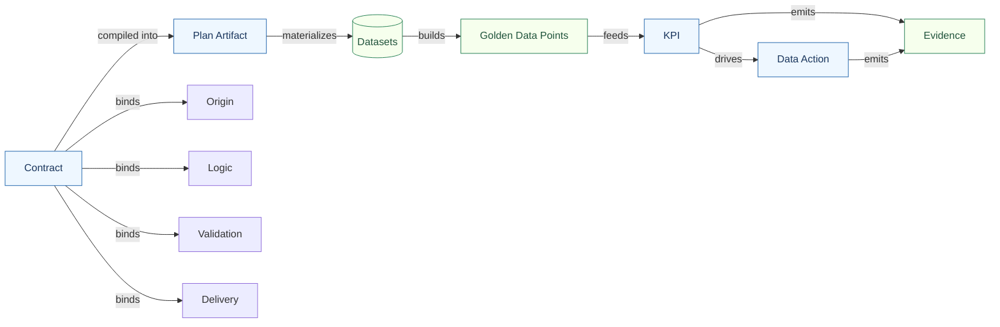
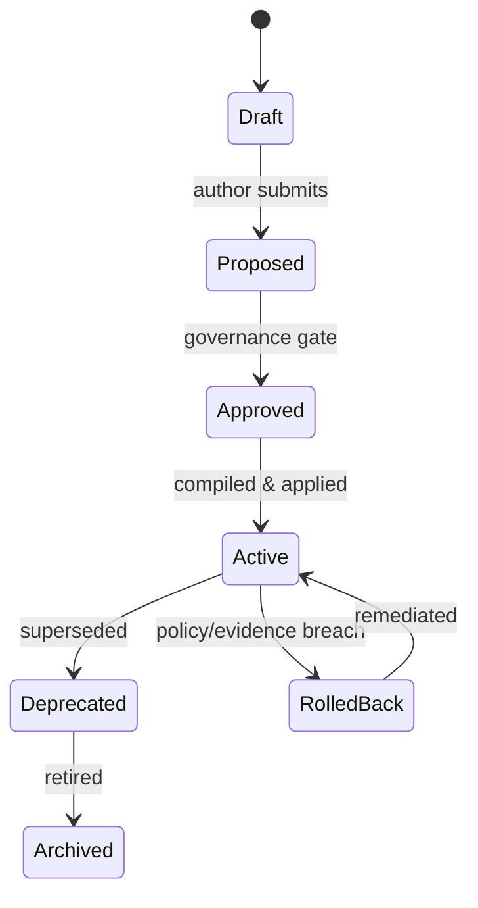
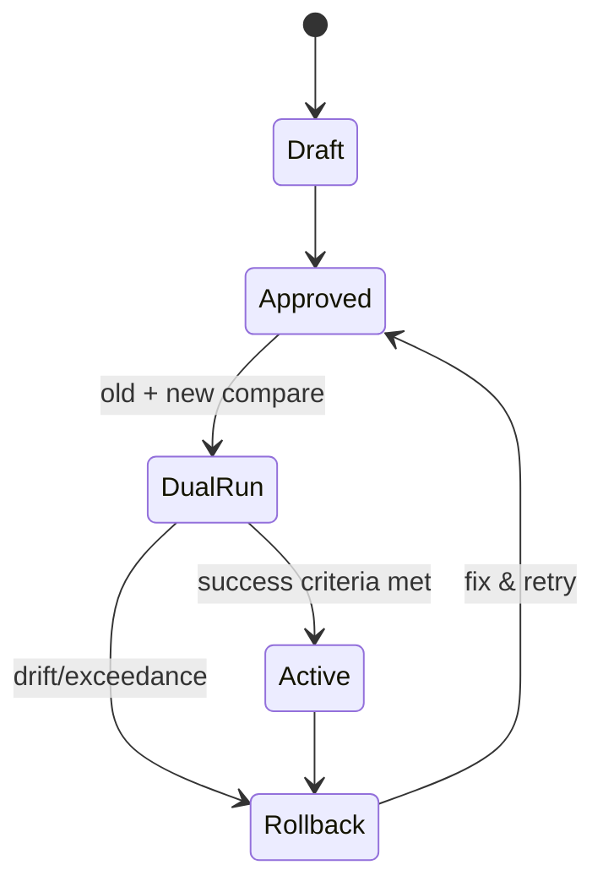
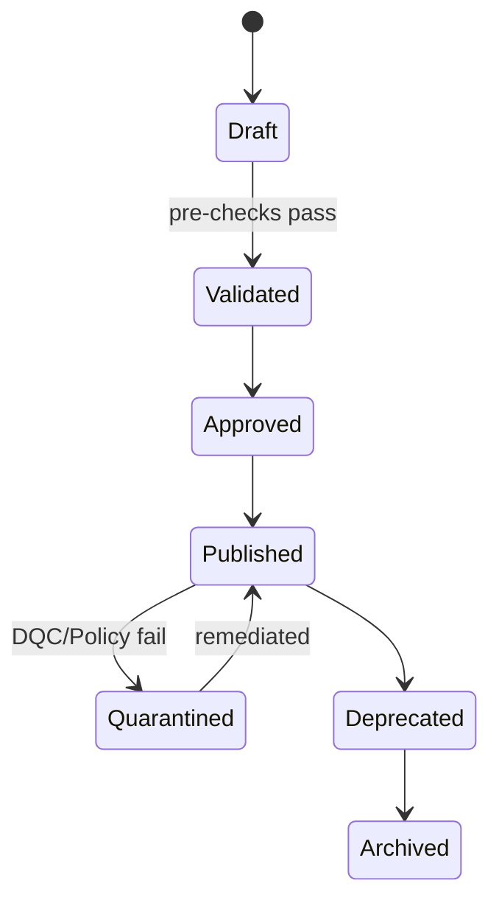
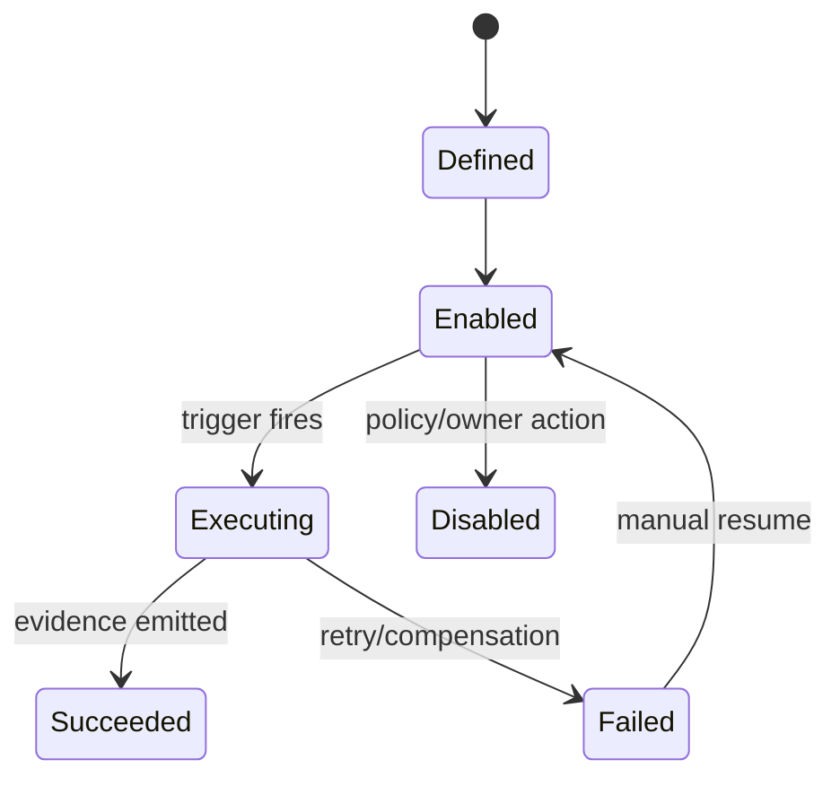
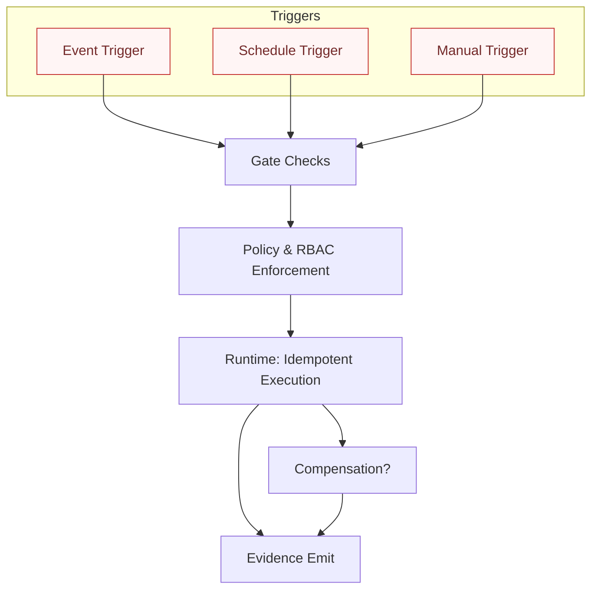
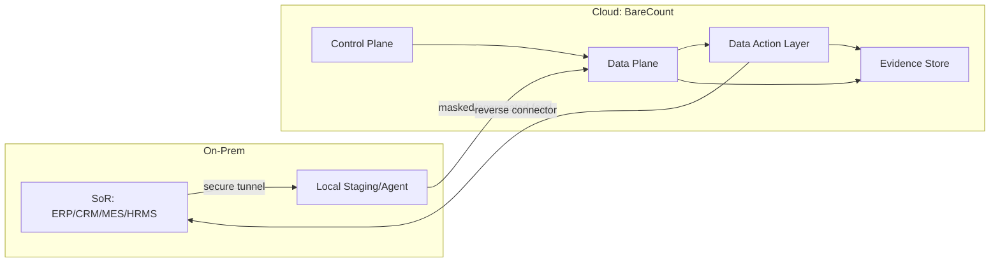

# Taxonomy — BareCount™ Platform

> Canonical terminology and relationships for the BareCount™ Data Action Platform.  
> Use this as the single source of truth for naming, scope, and interactions.

---

## 1) Purpose & Scope

- **Purpose:** Freeze the platform’s conceptual map so all docs, UX, APIs, and diagrams use the same language.
- **Scope:** Architecture layers, core artifacts, execution surfaces, lifecycles, and cross-cutting services.

---

## 2) Canonical Map (Layers & Surfaces)

## 3) Core Artifacts & Relationships

## 4) Lifecycle State Machines

### 4.1 Contract Lifecycle

### 4.2 Plan Artifact Lifecycle

### 4.3 KPI Lifecycle

### 4.4 Data Action Lifecycle

---

## 5) Trigger & Enforcement Model

## 6) Cross-Cutting Services (Where They Bite)

| Concern            | Control Plane                            | Data Plane                                   | Data Action Layer                             |
|--------------------|-------------------------------------------|----------------------------------------------|-----------------------------------------------|
| Identity & RBAC    | Authoring, approvals, registry access     | Build/read KPIs, evidence visibility         | Action ownership, trigger permissions         |
| Secrets & KMS      | Contract secrets refs, key policies       | Source creds, encryption at rest/in transit   | Connector creds, key usage audit              |
| Telemetry          | Policy eval metrics, governance latency   | Pipeline latency, freshness, success rates    | Action latency, retry counts, success ratio   |
| Lineage            | Contract lineage refs                     | Node/edge graph, impact analysis             | KPI→Action link & reverse connectors          |
| DQC                | Policy definitions (fail/soft-fail)       | Pre/post checks, reconcile, anomaly          | Preconditions for actions                     |
| Alerts             | Governance breaches                        | Freshness/drift/validation violations        | Action failures, compensation invoked         |
| Cost/Quota         | Plan budgets, approval thresholds         | Compute/storage quotas per tenant/artifact    | Action rate limits and budgets                |
| BCDR               | Registry backup, approval recovery        | Dataset/KPI backup & restore, RPO/RTO tiers  | Action replay safety, dedupe/idempotency      |
| Compliance/Evidence| Approval trails, policy proofs            | Validation evidence, lineage, data access    | Action proofs, external system receipts       |

---

## 7) Residency & Hybrid Patterns

## 8) RACI (High-Level Responsibilities)

| Area                | Host App (Admin) | Control Plane | Data Plane | Data Action Layer | Tenant App |
|---------------------|------------------|---------------|-----------:|------------------:|-----------:|
| Author Contracts    | R                | A             | C          | C                 | I          |
| Approvals/Governance| R/A              | A             | C          | C                 | I          |
| Compile Plan        | C                | R/A           | C          | I                 | I          |
| Build KPIs          | I                | C             | R/A        | I                 | I          |
| Run Actions         | I                | C             | I          | R/A               | C          |
| Evidence & Audits   | C                | R/A           | R          | R                 | C          |
| SLOs & Alerts       | C                | R/A           | R          | R                 | C          |

(A = Accountable, R = Responsible, C = Consulted, I = Informed)

---

## 9) Naming & Versioning Conventions

- **Contracts:** `MC.<domain>.<metric>.<major>` → `MC.FIN.AR.DSO.v1`
- **Plan Artifacts:** `PA.<domain>.<group>.<major>` → `PA.FIN.AR.v1`
- **Datasets:** `bronze|silver|gold.<domain>.<entity>`
- **KPIs:** `kpi.<domain>.<name>`
- **Data Actions:** `da.<domain>.<name>`
- **States:** `draft → proposed → approved → dual-run → active → deprecated → archived`
- **IDs:** include `tenant_id`, `plan_id`, `contract_id`, `version`, and `trace_id` in logs/evidence.

---

## 10) Quick Compliance Hooks

- **Evidence Pack** per KPI/period: contract hash, plan version, lineage snapshot, validation results, action receipts.
- **Dual-Run** required when **logic** or **origin** changes; 1:1 diff threshold must pass before promotion.
- **Soft-fail policy** only for non-financial, non-regulatory KPIs; **hard-fail** elsewhere.

---

**This taxonomy is canonical.**  
If a term or relationship isn’t here, propose an ADR before using it anywhere else.
