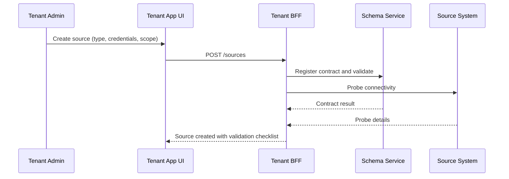
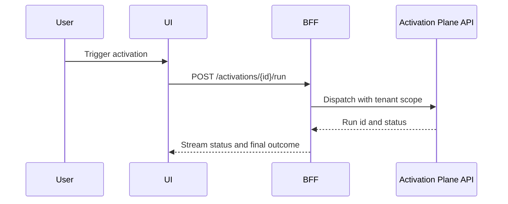

# Tenant App – Architecture

## Principles
- Separation of concerns: UI and BFF are distinct layers.  
- Tenant isolation: all calls are scoped to a single tenant.  
- Idempotence: all write operations use request IDs.  
- Auditability: every change is logged with correlation IDs.  
- Feature toggles: tenant-specific features are controlled by flags.  

## Components
- **Web UI**  
  - Built as a single-page application (SPA) or server-side rendered (SSR).  
  - Provides tenant-facing pages for onboarding, requests, dashboards, and activation.  
  - Uses client-side routing with secure protected routes.  

- **Back-for-Frontend (BFF)**  
  - Mediates between the UI and platform services.  
  - Exchanges tokens and enforces authorization scopes.  
  - Normalizes error handling and latency profiles.  
  - Shapes responses for UI consumption.  

- **Workers** (optional)  
  - Execute long-running validations, report exports, or retries.  
  - Decouple heavy processing from synchronous user flows.  

- **Webhook Dispatcher**  
  - Verifies event signatures.  
  - Queues activation events and forwards them to platform services.  

## Key Flows

### Source Onboarding

### Activation Run

## Deployment Model
- **UI**: served via CDN with WAF protection.  
- **BFF**: deployed regionally with blue/green deployment support.  
- **Connectivity**: calls platform APIs over private networking or mTLS-secured public endpoints.  
