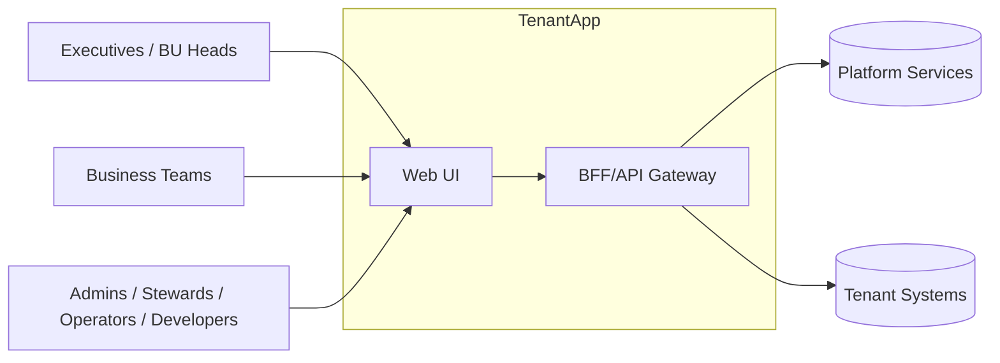

# Tenant App – Overview

## Purpose
The Tenant App is the tenant-facing application. It provides a secure surface for configuration, monitoring, and action.  
Executives and business teams use it to consume curated data and initiate workflows.  
Supporting roles enable administration, stewardship, operations, and integration.

## Responsibilities
- Connect and validate data sources  
- Manage users and roles  
- Configure outbound infrastructure bindings  
- Monitor service health and data freshness  
- Submit and approve requests  
- Access curated datasets and reports  
- Trigger or authorize activation flows  
- Use APIs and webhooks for integration  

## Scope
- **Included**  
  - Tenant-level administration  
  - Data access and report generation  
  - Workflow initiation and approvals  

- **Excluded**  
  - Cross-tenant governance  
  - SLA and error budget definitions  
  - Global contracts and compliance controls  
  (These are handled in the Host App)

## Personas
- **Executives (CXOs, BU Heads)**  
  - Consume KPIs and curated reports  
  - Approve requests and initiate actions  
  - Delegate tasks to business teams  

- **Business Team Members**  
  - Prepare reports and request approvals  
  - Support executives in decision making  

- **Admins**  
  - Configure sources, manage accounts, maintain bindings  

- **Stewards**  
  - Define data contracts and validate schema compliance  

- **Operators**  
  - Monitor health, review incidents, manage retries  

- **Developers**  
  - Build integrations and consume APIs  

## Relationships

## Documentation Structure
- **Foundations**: Architecture, Infrastructure, Security, Roles and Permissions  
- **Admin Ops**: Source Onboarding, User Management, Infrastructure Bindings  
- **Delivery and Activation**: Health, Requests, Data Access, Activation Panels  
- **Developer**: API Guide, API Reference  
- **Operations**: NFRs, Troubleshooting, Release Notes  
